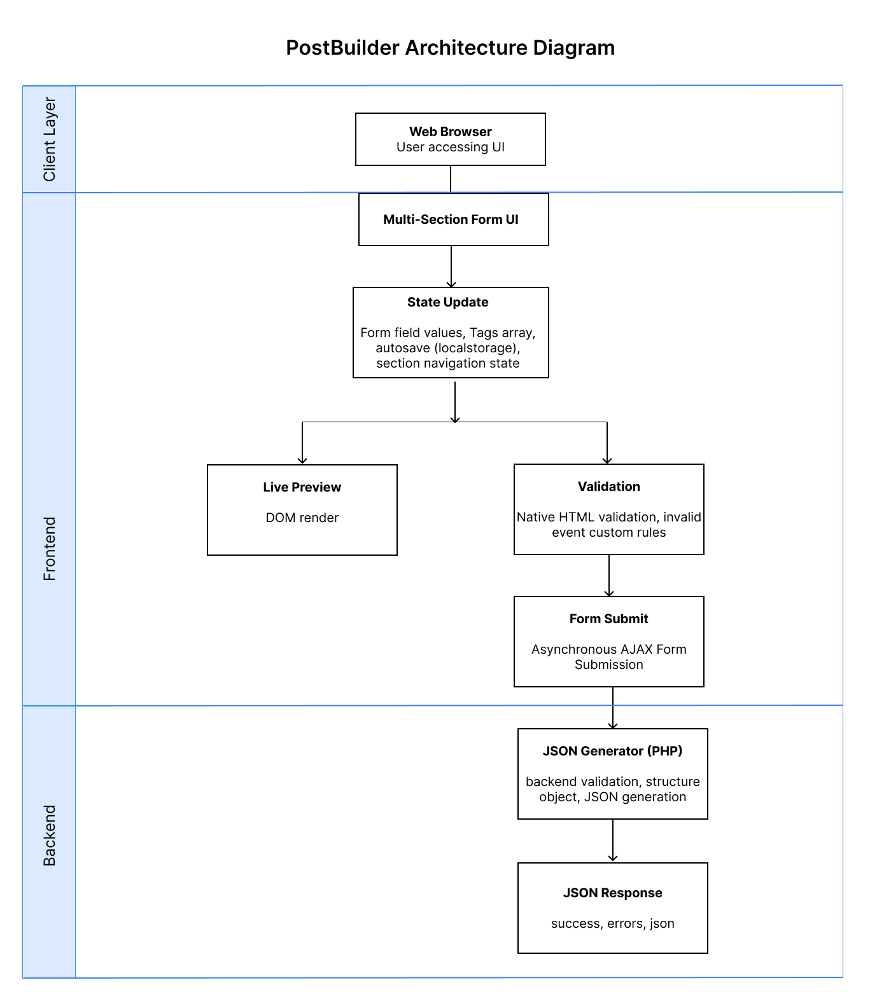
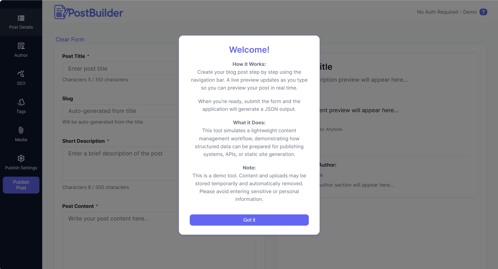
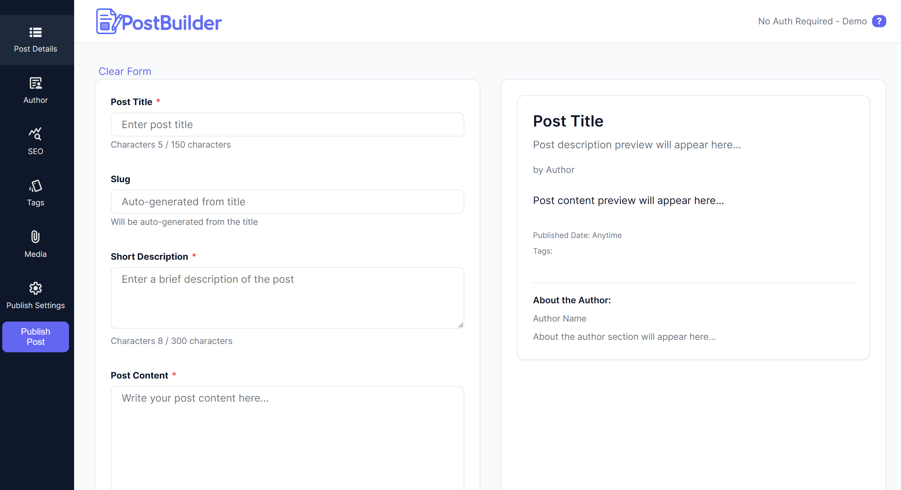
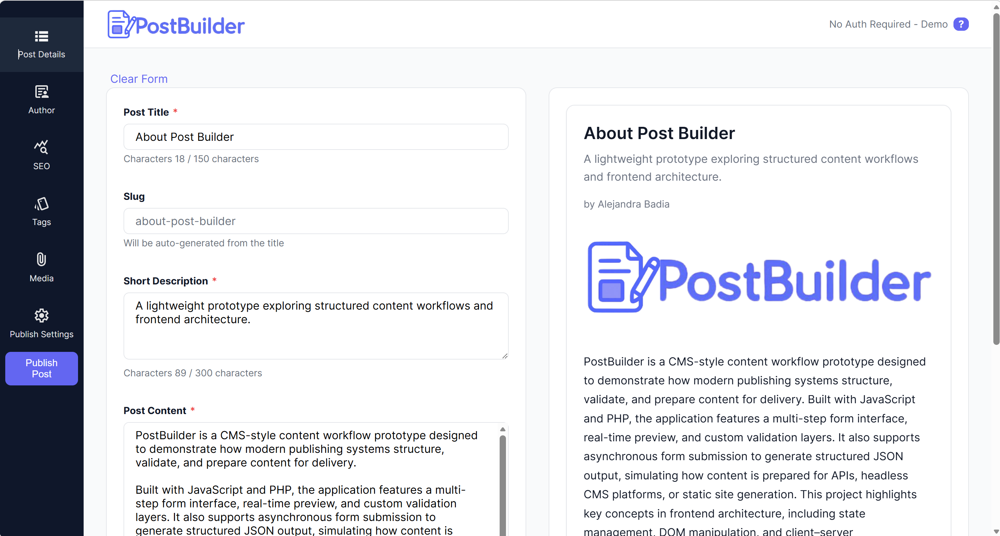
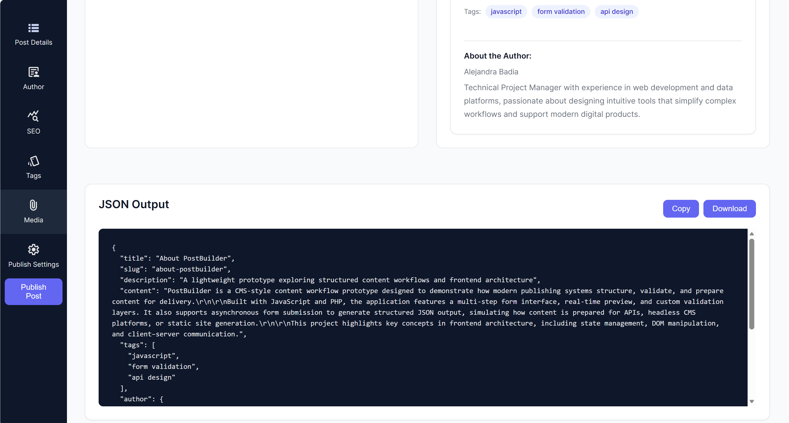

# PostBuilder
     


Structured Content Workflow & JSON Publishing Simulator


PostBuilder is a lightweight application that demonstrates how structured content workflows can reliably generate API-ready data. It models a common system challenge: transforming user input into consistent, validated JSON outputs that can be consumed by downstream services. The application includes multi-step input handling, real-time validation, asynchronous submission, and structured output generation.

---

## Table of Contents

- [Live Demo](#live-demo) 
- [Key Features](#key-features) 
- [Application Architecture](#application-architecture)
- [Product Development & Delivery](#product-development-&-delivery)
- [Workflow Overview](#workflow-overview) 
- [Form Sections](#form-sections)
- [Screenshots](#screenshots)
- [Live Preview](#live-preview) 
- [Validation System](#validation-system) 
- [JSON Output](#json-output) 
- [UI Design System](#ui-design-system) 
- [Technologies Used](#technologies-used) 
- [Purpose of the Project](#purpose-of-the-project) 
- [Project Status](#project-status) 
- [Author](#author) 

---

## Live Demo
https://postbuilder.smarterspec.tech/

---

## Key Features

- Multi-step content creation workflow with sidebar navigation 
- Real-time blog preview that updates as users type 
- Structured JSON generation for API-style workflows 
- Native form validation with custom UI handling 
- Section-aware validation (auto-navigation to invalid fields) 
- Asynchronous form submission with progress modal 
- Copy and download JSON utilities 
- Responsive layout for desktop and mobile
- End-to-end validation ensuring consistency between frontend input and backend output

---

## Application Architecture



PostBuilder follows a **frontend-driven architecture with a lightweight backend**. The architecture emphasizes UI state management, user feedback, and structured data generation.

The system enforces a clear contract between frontend input state and backend-generated JSON output to ensure data consistency.

---

## Product Development & Delivery
PostBuilder was developed using a structured Agile (Scrum-based) workflow to simulate real-world product development practices.

### Backlog & Planning
- Created and managed a structured backlog in Jira
- Defined features (stories), bug fixes, and acceptance criteria
- Estimated work using story points
- Prioritized MVP features to ensure focused delivery

### Sprint Execution
- Organized development into 2 sprints:
  - Sprint 1: Core content workflow (UI, preview, validation)
  - Sprint 2: Backend processing, JSON output, and data handling
- Managed dependencies between frontend state, validation, and backend logic
- Maintained clear separation between frontend and backend responsibilities

### Scope & Prioritization
- Focused on delivering a functional MVP first
- Deferred non-critical features to reduce scope creep
- Balanced user experience improvements with backend reliability

### Problem Solving
- Identified and resolved a tag persistence issue affecting data consistency
- Ensured alignment between frontend state and backend processing
- Conducted end-to-end validation of submission and JSON output workflows

### Outcome
- Delivered a complete MVP in 2 sprints
- Achieved full completion of planned sprint scope
- Established a structured content model for API-driven workflows
- Established a consistent data contract between UI input and structured output, reducing integration ambiguity

---

## Workflow Overview
The application simulates a simplified CMS publishing experience: 
1. User navigates through form sections via sidebar
2. Content is entered and preview updates in real time
3. Validation enforces required structure and data consistency
4. Data is submitted asynchronously to backend processing
5. Backend generates structured JSON output
6. Output is returned and displayed for downstream use 

---

## Form Sections 
### Post Details 
- Title (auto-generates slug) 
- Description - Content 

### Author 
- Name 
- Role 
- Bio 

### SEO 
- Meta Title 
- Meta Description 

### Tags 
- Dynamic tag input system 
- Tag pills UI 

### Media 
- Featured image upload 
- Client-side preview 

### Publish Settings 
- Publish preference 
- Optional scheduled date 

---

## Screenshots

|  Initial Load  | Form Section  |
|----------------|---------------|
|  |  |

|     Filled Form       |Generated JSON|
|-----------------------|--------------|
|  |  |

---

## Live Preview 
The live preview updates instantly as users input content. It simulates a blog post card including: - title 
- author 
- description 
- content 
- tags 
- publish date 
- featured image 

This demonstrates real-time DOM updates and product-style UI feedback. 

---

## Validation System 
PostBuilder uses **native HTML5 validation enhanced with custom behavior**. Features include: 
- required field validation 
- character limits 
- custom invalid event handling 
Custom UX improvements: 
- automatically navigates to the section containing invalid fields 
- syncs sidebar active state 
- scrolls to the relevant section 
- focuses invalid inputs 
- displays global error messaging

---

## JSON Output
The application generates a structured JSON payload based on user input. Example: ```json { "title": "Post Title", "slug": "post-title", "description": "...", "content": "...", "tags": [], "author": { "name": "...", "role": "...", "bio": "..." }, "metaTitle": "...", "metaDescription": "...", "featuredImage": "...", "publishPreference": "...", "specificPublishDate": "..." } ``` 
The JSON is displayed in a formatted preview panel after submission. This output structure represents a contract that can be consumed by APIs or downstream systems.

---

## UI Design System

PostBuilder uses a lightweight design system built with CSS variables. 
Key principles: 
- consistent spacing and layout 
- card-based UI structure 
- sidebar navigation with active states 
- modal-based feedback system 
- responsive design for smaller screens 

--- 

## Technologies Used
- HTML 
- CSS (custom design system with variables) 
- JavaScript (vanilla, modular structure) 
- PHP (JSON generation endpoint) 
- AJAX (XMLHttpRequest for async submission) 

--- 

## Security Considerations
This project includes several safeguards to ensure safe handling of user input and file uploads:

### Input Handling & XSS Prevention
•	User-generated content is rendered using safe DOM methods such as textContent to prevent script execution
•	Avoids use of innerHTML for dynamic content where possible
•	Input fields are sanitized and constrained using character limits

### Slug Sanitization
•	Slugs are normalized and restricted to alphanumeric characters and hyphens
•	Prevents path traversal and malicious filename injection

### File Upload Validation
•	Accepts only specific file types (JPEG, PNG)
•	Validates both MIME type and file extension
•	Enforces file size limits
•	Uploaded files are renamed using sanitized slugs to prevent execution of malicious filenames

### Storage Protection
•	Limits the number of generated JSON files to prevent abuse or storage overflow

### Client + Server Validation
•	Validation is implemented on both frontend and backend to ensure data integrity and prevent bypassing client-side restrictions

---

## Purpose of the Project 
This project demonstrates how frontend-driven systems can enforce data structure, validation, and consistency to support reliable integration with backend services and APIs.

It focuses on solving a common system problem: ensuring that user-generated input is transformed into structured, machine-readable data. 

--- 

## Project Status
Current version includes: 
- multi-step form navigation 
- live preview system 
- validation with guided UX 
- JSON generation and display
- asynchronous submission with modal feedback 

Future improvements may include: 
- database persistence 
- CMS API integration 
- markdown editor support 
- autosave controls 
- multi-user workflows 

---

## Author

Portfolio project created by Alejandra Badia


